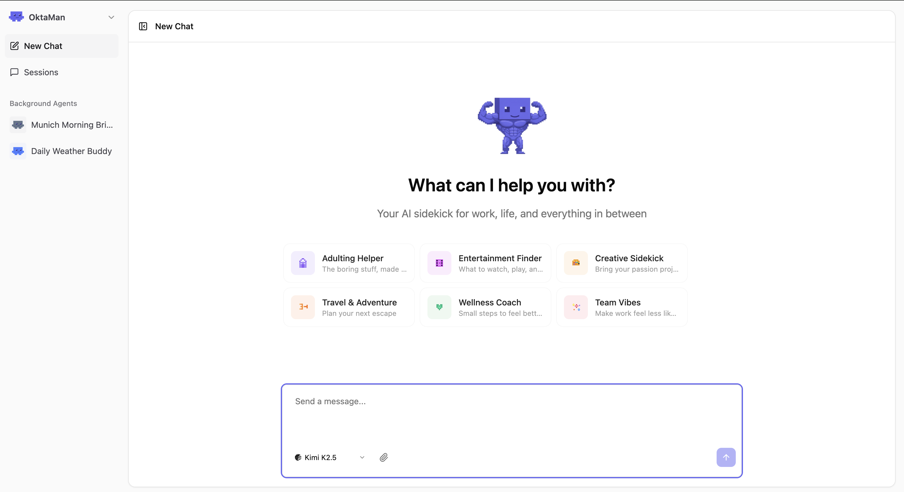
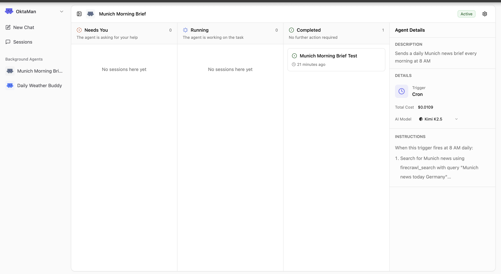

<p align="center">
  
</p>

<h1 align="center">OktaMan</h1>

<p align="center">
  <strong>Your AI-powered command center that runs locally.</strong><br>
  One place to manage your life, automate tasks, and get things done — all from your machine.
</p>

<p align="center">
  <a href="#quick-start">Quick Start</a> &middot;
  <a href="#features">Features</a> &middot;
  <a href="#development">Development</a> &middot;
  <a href="#contributing">Contributing</a>
</p>

---

<p align="center">
  
</p>

<p align="center">
  
</p>

---

## Quick start

```bash
curl -fsSL https://raw.githubusercontent.com/AbuAboud/oktaman/main/scripts/install.sh | bash
```

Once installed, OktaMan runs as a background service at **http://localhost:4321**.

```bash
oktaman open       # Open in browser
oktaman status     # Check if running
oktaman logs       # View recent logs
oktaman restart    # Restart the service
oktaman update     # Update to latest version
oktaman help       # Show all commands
```

On first launch, a setup wizard walks you through connecting your AI provider and configuring your preferences. You can re-run the wizard anytime from **Settings**.

## Features

- **Command center** - A single hub to chat, delegate tasks, and orchestrate your digital life
- **Agents** - Deploy autonomous agents with custom prompts, tools, and schedules that work in the background
- **Tools** - Execute commands, browse the web, scrape pages, manage to-dos, and more — all from the chat
- **Memory** - Persistent memory across sessions so context is never lost
- **Skills** - Extensible skill system for specialized domain knowledge and workflows
- **Telegram** - Connect a Telegram bot so your command center is always reachable
- **Integrations** - Plug in external services (Gmail, GitHub, Slack, etc.) via Composio
- **Multi-model** - Route to any model through OpenRouter — Claude, GPT, Gemini, Llama, and more
- **100% local** - SQLite database at `~/.oktaman/`, nothing sent anywhere you don't control

## How it works

```
oktaman/
├── packages/
│   ├── server/   # Fastify API, AI orchestration, tools, database
│   ├── ui/       # React frontend with real-time chat interface
│   └── shared/   # Shared types and utilities
└── bin/
    └── oktaman.js  # CLI entry point
```

The server handles AI model routing, tool execution, agent scheduling, and persistent storage. The UI connects over WebSockets for real-time streaming. Everything runs on your machine.

## Configuration

All data lives in `~/.oktaman/`:

| Path | Description |
|------|-------------|
| `~/.oktaman/data.db` | SQLite database |
| `~/.oktaman/home/` | Working directory for agents |
| `~/.oktaman/home/skills/` | Installed skills |
| `~/.oktaman/storage/` | File uploads and attachments |

The setup wizard configures these on first launch. To change settings later, open **Settings** from the sidebar.

| Setting | Description |
|---------|-------------|
| **OpenRouter API Key** | Required. Get one at [openrouter.ai/keys](https://openrouter.ai/keys) |
| **Default Model** | AI model to use (default: `anthropic/claude-sonnet-4`) |
| **Composio API Key** | For external tool integrations |
| **Firecrawl API Key** | For web scraping tools |

## Development

```bash
npm run dev     # Start server + UI with hot reload
npm run build   # Build all packages
npm run lint    # Lint all packages
npm run test    # Run tests
npm run clean   # Remove build artifacts
```

Dev server runs at `http://localhost:4200` (proxies API calls to the backend at port 4321).

### Tech stack

**Backend:** Fastify, TypeORM, SQLite, Socket.IO, Vercel AI SDK, OpenRouter

**Frontend:** React, Vite, TanStack Query, Tailwind CSS, Radix UI

## Troubleshooting

**Database errors** - Delete `~/.oktaman/data.db` and restart. It will be recreated.

**Port in use** - Kill the process: `lsof -ti:4321 | xargs kill`

**API key not working** - Verify the key in Settings and check it has credits.

## License

MIT
